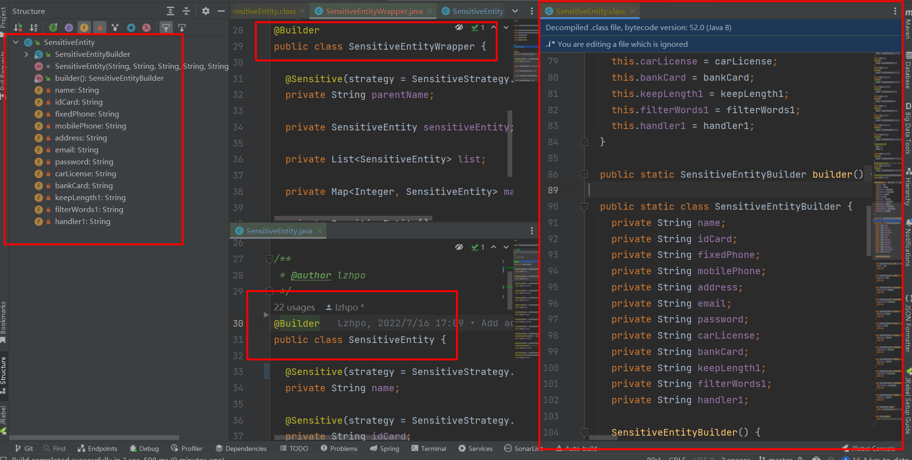

[](https://github.com/lzhpo/sensitive-spring-boot-starter/actions/workflows/style-check.yml)
[](https://www.codacy.com/gh/lzhpo/sensitive-spring-boot-starter/dashboard?utm_source=github.com&amp;utm_medium=referral&amp;utm_content=lzhpo/sensitive-spring-boot-starter&amp;utm_campaign=Badge_Grade)

## 开源地址

- GitHub：[https://github.com/lzhpo/sensitive-spring-boot-starter](https://github.com/lzhpo/sensitive-spring-boot-starter)
- Gitee：[https://gitee.com/lzhpo/sensitive-spring-boot-starter](https://gitee.com/lzhpo/sensitive-spring-boot-starter)

## 如何使用？

### 1.导入依赖

> 依赖已发布至Maven中央仓库，可直接引入依赖。

- Maven：
  ```xml
  <dependency>
    <groupId>com.lzhpo</groupId>
    <artifactId>sensitive-spring-boot-starter</artifactId>
    <version>${latest-version}</version>
  </dependency>
  ```
- Gradle:
  ```groovy
  implementation 'com.lzhpo:sensitive-spring-boot-starter:${latest-version}'
  ```

### 2.实体类字段上使用`@Sensitive`注解配置脱敏规则

`@Sensitive`注解说明：
- `strategy`：脱敏策略，支持12种脱敏策略。
- `replacer`：脱敏策略的替换符，默认脱敏替换符为星号`*`，可以配置为任意字符。 
  比如：配置为`#`
  ```java
  @Sensitive(strategy = SensitiveStrategy.CHINESE_NAME, replacer = '#')
  private String name;
  ```

#### 2.1.支持的脱敏策略

*以下数据均为随意构造的测试数据，如有相同，纯属巧合。*

##### 2.1.1 中文姓名

只显示第一个汉字，其他隐藏为2个星号。

```java
@Sensitive(strategy = SensitiveStrategy.CHINESE_NAME)
private String name;
```
比如：`刘子豪`脱敏之后为`刘**`。

##### 2.1.2 身份证号

保留前1位和后2位。

```java
@Sensitive(strategy = SensitiveStrategy.ID_CARD)
private String idCard;
```
比如：`530321199204074611`脱敏之后为`5***************11`。

##### 2.1.3 固定电话

保留前4位和后2位。

```java
@Sensitive(strategy = SensitiveStrategy.FIXED_PHONE)
private String fixedPhone;
```
比如：`01086551122`脱敏之后为`0108*****22`。

##### 2.1.4 手机号码

保留前3位和后4位。

```java
@Sensitive(strategy = SensitiveStrategy.MOBILE_PHONE)
private String mobilePhone;
```
比如：`13248765917`脱敏之后为`132****5917`。

##### 2.1.5 地址

只显示到地区，不显示详细地址，地址长度减去8即为前缀保留的长度，后缀均用星号代替。

```java
@Sensitive(strategy = SensitiveStrategy.ADDRESS)
private String address;
```
比如：`广州市天河区幸福小区102号`脱敏之后为`广州市天河区********`。

##### 2.1.6 电子邮箱

邮箱前缀仅显示第一个字母，前缀其他隐藏，用星号代替，@及后面的地址显示。

```java
@Sensitive(strategy = SensitiveStrategy.EMAIL)
private String email;
```
比如：`example@gmail.com`脱敏之后为`e******@gmail.com`。

##### 2.1.7 密码

全部字符都用星号`*`代替。

```java
@Sensitive(strategy = SensitiveStrategy.PASSWORD)
private String password;
```
比如：`123456`脱敏之后为`******`。

##### 2.1.8 车牌号

车牌中间用星号`*`代替。

```java
@Sensitive(strategy = SensitiveStrategy.CAR_LICENSE)
private String carLicense;
```
比如：`粤A66666`脱敏之后为`粤A6***6`。

##### 2.1.9 银行卡号

保留前4位和后4位，中间的使用星号`*`代替，且中间的从第1位起，每隔4位添加一个空格用来美化。

```java
@Sensitive(strategy = SensitiveStrategy.BANK_CARD)
private String bankCard;
```
例如：`9988002866797031`脱敏之后为`9988 **** **** 7031`。

##### 2.2.1 自定义脱敏策略

当前支持三种风格的自定义脱敏策略：
1. 保留前后缀脱敏策略。
2. 敏感字符脱敏策略。
3. Handler脱敏策略。

###### 2.2.1.1 保留前后缀脱敏策略

使用`@Sensitive(strategy = SensitiveStrategy.CUSTOMIZE_KEEP_LENGTH)`配合`@SensitiveKeepLength`一起使用。

`@SensitiveFilterWords`注解：
- `preKeep`是字符串前置保留字符个数。
- `postKeep`是字符串后置保留字符个数。

举个例子：`name`前后都只保留1个字符。

```java
@Sensitive(strategy = SensitiveStrategy.CUSTOMIZE_KEEP_LENGTH)
@SensitiveKeepLength(preKeep = 1, postKeep = 1)
private String name;
```

如果`name`为`1234`，脱敏之后就是`1**4`。

###### 2.2.1.2 敏感字符脱敏策略

使用`@Sensitive(strategy = SensitiveStrategy.CUSTOMIZE_FILTER_WORDS)`配合`@SensitiveFilterWords`一起使用。

`@SensitiveFilterWords`注解：定义敏感字符。

举个例子：脏话关键字脱敏。

```java
@Sensitive(strategy = SensitiveStrategy.CUSTOMIZE_FILTER_WORDS)
@SensitiveFilterWords({"他妈的", "去你大爷", "卧槽", "草泥马", "废物"})
private String description;
```

如果`description`的值为`卧槽，他妈的，我去你大爷的，草泥马`，脱敏之后就是`**，***，我****的，***`。

###### 2.2.1.3 Handler脱敏策略

Handler脱敏策略完全由开发者进行处理，不受`@Sensitive`注解上的`replacer`脱敏替换符影响。

使用`@Sensitive(strategy = SensitiveStrategy.CUSTOMIZE_HANDLER)`配合`@SensitiveHandler`一起使用。

`@SensitiveHandler`注解：表示处理脱敏的Handler。

例如：将`name`字段都设置为`@#@`。

```java
@Sensitive(strategy = SensitiveStrategy.CUSTOMIZE_HANDLER)
@SensitiveHandler(FaceCustomizeSensitiveHandler.class)
private String name;
```

```java
public class FaceCustomizeSensitiveHandler implements CustomizeSensitiveHandler {

  @Override
  public String customize(SensitiveWrapper sensitiveWrapper) {
    // 字段
    Field field = sensitiveWrapper.getField();
    // 字段归属的对象
    Class<?> objectClass = field.getDeclaringClass();
    // 字段上的注解
    Annotation[] annotations = field.getAnnotations();
    // 字段值
    String fieldValue = sensitiveWrapper.getFieldValue();
    // 注解信息
    Sensitive sensitive = sensitiveWrapper.getSensitive();
    return "@#@";
  }
}
```

可以看到，提供了含有`@Sensitive`注解的字段、字段值、字段归属的对象、注解的信息等等供开发者定制。

### 3.使用`@IgnoreSensitive`注解标注在controller上可忽略脱敏

#### 1.在Controller类上使用`@IgnoreSensitive`表示此类下所有接口都忽略脱敏

此controller下的所有接口都将忽略脱敏。

```java
@RestController
@IgnoreSensitive
@RequestMapping("/ignore")
public class NoSensitiveController {

  @GetMapping("sample3")
  public ResponseEntity<SampleJavaBean> sample3() {
    return ResponseEntity.ok(SampleJavaBeanMock.sampleJavaBean());
  }

  @GetMapping("sample4")
  public ResponseEntity<SampleJavaBean> sample4() {
    return ResponseEntity.ok(SampleJavaBeanMock.sampleJavaBean());
  }
}
```

#### 2.在Controller的方法中使用`@IgnoreSensitive`表示此接口忽略脱敏

```java
@RestController
@RequestMapping("/")
public class SensitiveController {

  @GetMapping("sample1")
  public ResponseEntity<SampleJavaBean> sample1() {
    return ResponseEntity.ok(SampleJavaBeanMock.sampleJavaBean());
  }

  @IgnoreSensitive
  @GetMapping("ignore/sample2")
  public ResponseEntity<SampleJavaBean> sample2() {
    return ResponseEntity.ok(SampleJavaBeanMock.sampleJavaBean());
  }
}
```

sample2将忽略`SampleJavaBean`对象的字段脱敏，sample1不影响。

## 注意事项

### 1.有关单独使用`@Builder`/`@SuperBuilder`注解、实体类多层嵌套问题

需要数据脱敏的实体类以及嵌套类都应提供对应成员变量的get方法，否则JSON组件无法获取到嵌套的成员变量进行脱敏！

- 错误示范：嵌套对象单独使用一个`@Builder`/`@SuperBuilder`

  

- **正确示范**：如果需要使用到`@Builder`/`@SuperBuilder`，那么需要配合`@Data`或`@Getter`一起使用。
  
  例如：
  ```java
  @Data
  @Builder
  @NoArgsConstructor
  @AllArgsConstructor
  public class SensitiveEntity {
  
    @Sensitive(strategy = SensitiveStrategy.CHINESE_NAME)
    private String name;
  
    @Sensitive(strategy = SensitiveStrategy.ID_CARD)
    private String idCard;
  }
  ```

### 2.将默认的Jackson切换为FastJson（不推荐）

1. 加入FastJson依赖（同时支持FastJson1和FastJson2）：
    ```xml
    <dependency>
      <groupId>com.alibaba</groupId>
      <artifactId>fastjson</artifactId>
      <version>1.x.x/2.x.x</version>
    </dependency>
    ```
2. 将`FastJsonHttpMessageConverter`声明为Bean即可，`sensitive-spring-boot-starter`会自动注入相关逻辑。
    ```java
    @Bean
    public FastJsonHttpMessageConverter fastJsonHttpMessageConverter() {
      return new FastJsonHttpMessageConverter();
    }
    ```

### 3.关闭此数据脱敏功能

移除此maven依赖即可

## 公众号

|         微信          |            公众号             |
|:-------------------:|:--------------------------:|
|  |  |
